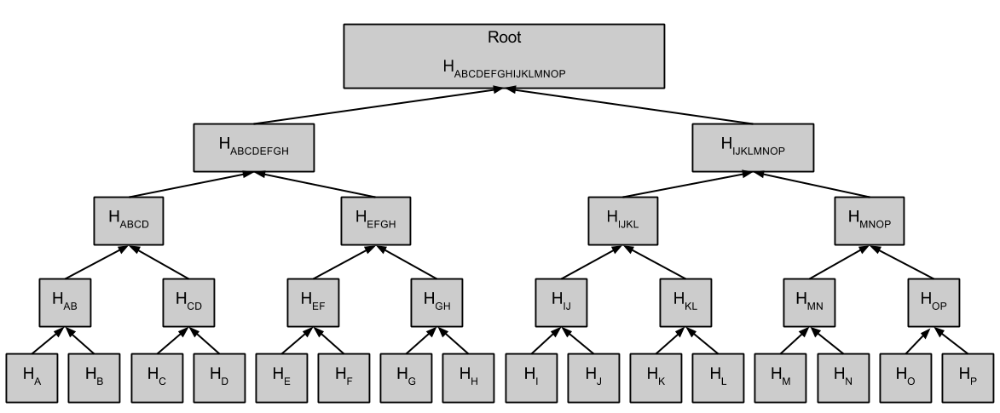

=========================================
Tamper-evident-Data-Structure-Merkle-Tree
=========================================

Overview
---------------

Merkle Tree is a data structure aiming to provide tamper-evident logging.
This data structure maintains a tree structure, which merely uses its
leaf nodes to store data,
with internal nodes storing the iteratively cumulated hash value of
the leaves.
The hash value of the tree's root will serves as a certificate for the
intactness of all the data in this tree.
Thus, the Merkle Tree structure proves to be efficient in authenticating data's integrity.

Modules Introduction
-----------------------

+ **Node**: a class to manage the local information of each log, which
  includes data, timestamp, hash value, sibling/child/parent node index.

+ **Mtree**: a class to maintain the core function of Merkle Tree, which involves the construction, reshape, add/set,
  computeCommitment, findPath, generateProof, verifyConsistency, etc. function.

+ **Auditor**: a class to implement consistency verification.

Data Structure Design
--------------------------------

*Index struct*
~~~~~~~~~~~~~~~~~~~
The index of nodes in the tree is defined as follows: For all nodes,
the index is defined as a pair (number, level),
where level denotes which level it belongs, and number denotes the
smallest index of the leaf that belongs to its subtree.
For leaf node, especially,
idx is exactly the index of the leaf itself and lev equals to 0
(both level and index starts from 0).

*Leaf and Internal Nodes*
~~~~~~~~~~~~~~~~~~~~~~~~~~~~

+ Node class member variable

+------------+-------------------------+-----------------------------------------------------------------------------+
|Name        | Type                    | Description                                                                 |
+------------+-------------------------+-----------------------------------------------------------------------------+
|hashValue   | `ndn::ConstBufferPtr`   | hash value of data                                                          |
+------------+-------------------------+-----------------------------------------------------------------------------+
|m_index     | `Index`                 | No. and level of the leaf                                                   |
+------------+-------------------------+-----------------------------------------------------------------------------+
|m_timestamp | TBD                     | Not Added Yet.(Attribute: the maximum timestamp in the subtree of this node)|
+------------+-------------------------+-----------------------------------------------------------------------------+

+ Node class member function

+---------------+---------------------------------------------------------------------------------+
|Name           |    Description                                                                  |
+---------------+---------------------------------------------------------------------------------+
|`getIndex()`   |                                                                                 |
+---------------+---------------------------------------------------------------------------------+
|`getTimestp()` |                                                                                 |
+---------------+---------------------------------------------------------------------------------+
|`computeHash()`| compute the aggregation hash value of its children by invoking Hasher's function|
+---------------+---------------------------------------------------------------------------------+

+ Leaf-node subclass member variable

+------+-----------------------+---------------------+
|Name  | Type                  | Description         |
+------+-----------------------+---------------------+
|m_data| `ndn::ConstBufferPtr` |store raw data       |
+------+-----------------------+---------------------+

+ Leaf-node subclass member function

+---------+--------------------+
|Name     |  Description       |
+---------+--------------------+
|getData()|get the certificate |
+---------+--------------------+

+ Internal-node subclass member variable

+--------+---------+-----------------------------------------------------+
|Name    | Type    | Description                                         |
+--------+---------+-----------------------------------------------------+
|m_isFull| `bool`  | whether the leaves in the subtree all set with data |
+--------+---------+-----------------------------------------------------+

+ Internal-node subclass member function

+----------+-------------------------------------------+
|Name      | Description                               |
+----------+-------------------------------------------+
|`isFull()`| judge whether the subtree is full of data |
+----------+-------------------------------------------+

*Merkle Tree*
~~~~~~~~~~~~~~~~~~~~~~~~~

+ MTree class member variable

+----------+--------------------+--------------------------------+
|Name      | Type               | Description                    |
+----------+--------------------+--------------------------------+
|tree      |`map<Index, Node>`  | Index contains all informations|
+----------+--------------------+--------------------------------+
|treeLevel |`size_t`            | height of the tree             |
+----------+--------------------+--------------------------------+
|leafNum   |`size_t`            | stored data item number        |
+----------+--------------------+--------------------------------+

+ MTree class member function

+-----------------+---------------------------+----------------------+--------------------------------------------------+
|Name             | argument                  |  return value        | Description                                      |
+-----------------+---------------------------+----------------------+--------------------------------------------------+
|`getNode()`      |`Index index`              |`Node* node`          | fetch node in the tree, given a index            |
+-----------------+---------------------------+----------------------+--------------------------------------------------+
|`getLevel()`     |                           |`size_t level`        |                                                  |
+-----------------+---------------------------+----------------------+--------------------------------------------------+
|`getLeafNum()`   |                           |`size_t leaf_num`     |                                                  |
+-----------------+---------------------------+----------------------+--------------------------------------------------+
|`addLeaf()`      |`ndn::ConstBufferPtr info` |                      | add a info into the MTree (recalculate root hash |
|                 |                           |                      | and update the tree info every time)             |
+-----------------+---------------------------+----------------------+--------------------------------------------------+
|`generateProof()`|`size_t version1, version2`| `vector<Node*> proof`|generate a pruned tree proof between version1 and |
|                 |                           |                      |version2                                          |
+-----------------+---------------------------+----------------------+--------------------------------------------------+

*Auditor*
~~~~~~~~~~~~~~~~

+ Auditor class member function

+---------------------+----------------------------------------------------+---------------------+----------------------+
|Name                 | argument                                           |  return value       | Description          |
+---------------------+----------------------------------------------------+---------------------+----------------------+
|`verifyConsistency()`|`size_t version1, version2, size_t present_version, |`bool isConsistent`  |verify whether the    |
|                     |ndn::ConstBufferPtr hash1, ndn::ConstBufferPtr hash2|                     |version1 and version2 |
|                     |,std::vector<Node*> proof`                          |                     |are consistent        |
+---------------------+----------------------------------------------------+---------------------+----------------------+
|`queryByTime()`      |`std::time_t`                                       |`vector<Node*> nodes`|find nodes that       |
|                     |                                                    |                     |is generated later    |
|                     |                                                    |                     |later than given time |
+---------------------+----------------------------------------------------+---------------------+----------------------+
